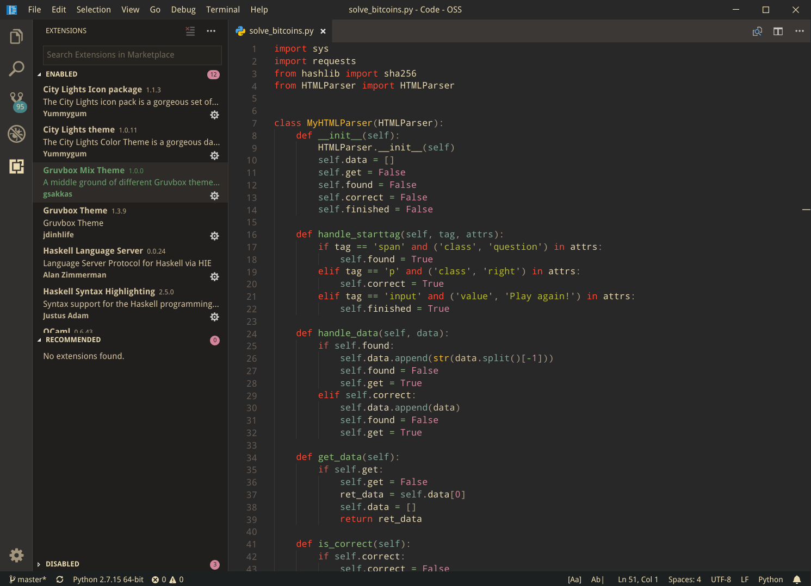
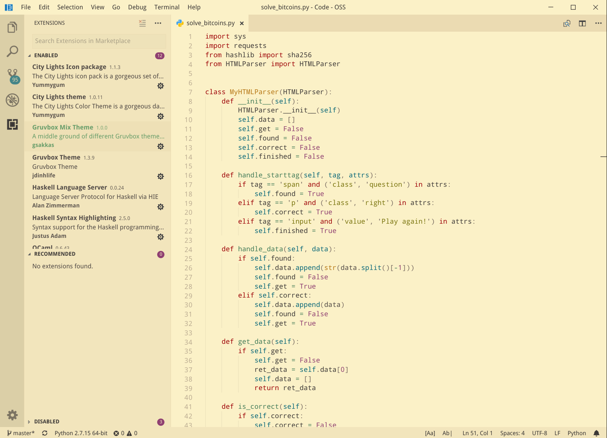
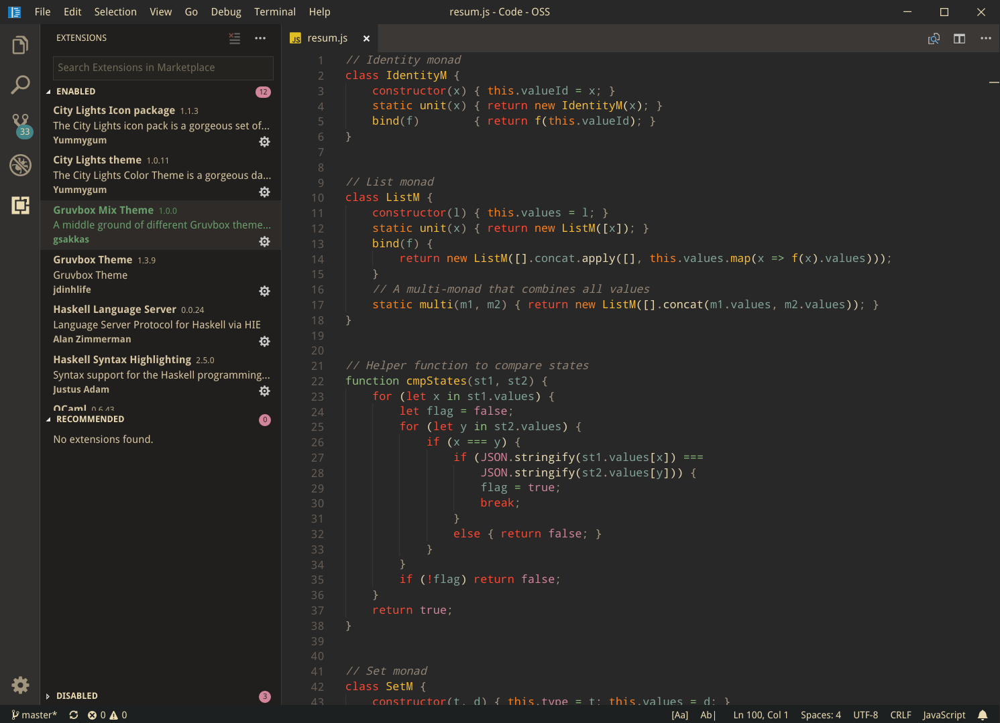
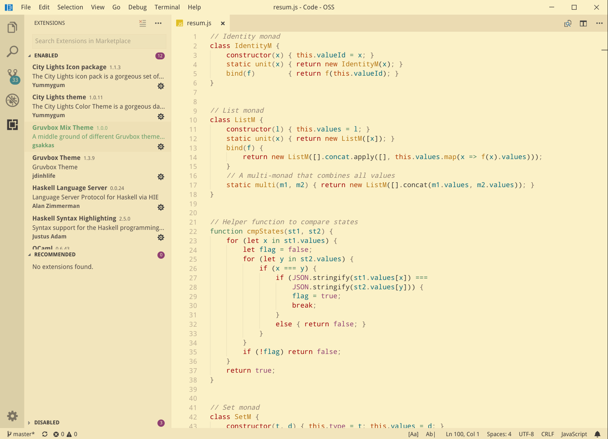
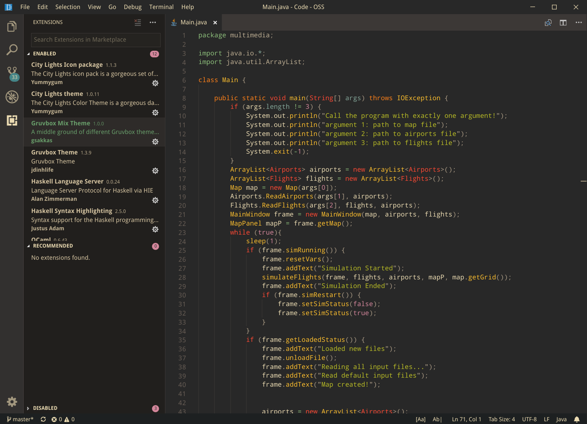
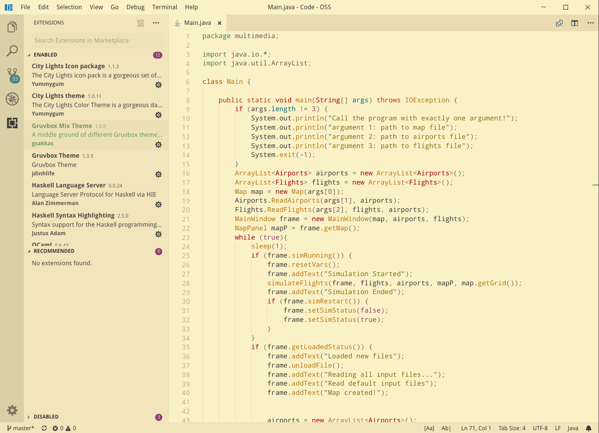

# Gruvbox Mix Theme

This is a [gruvbox](https://github.com/morhetz/gruvbox) theme for VS Code, including syntax highlighting and workbench & terminal colors. It's a mix of different gruvbox themes found online, but it is mostly inspired by [this](https://github.com/jdinhify/vscode-theme-gruvbox) theme and it uses many of its color palette. The difference of our theme is that is not so flat looking and does not use VS Code's default theme colors.

## Variants

There are two variations of this theme: a *dark* theme and  a *light* theme. Both are based on the medium contrast variation of the gruvbox theme.

## Screenshots

### Python

### JavaScript

### Haskell

### Java

